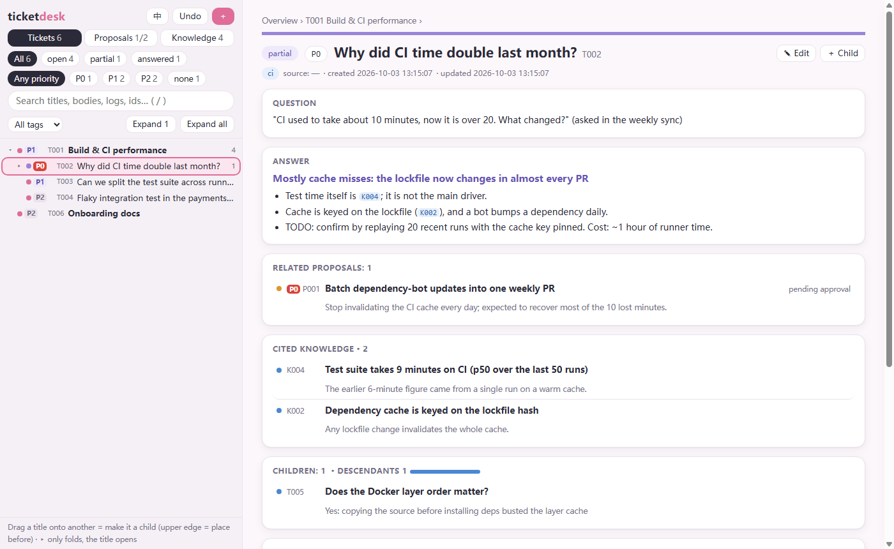
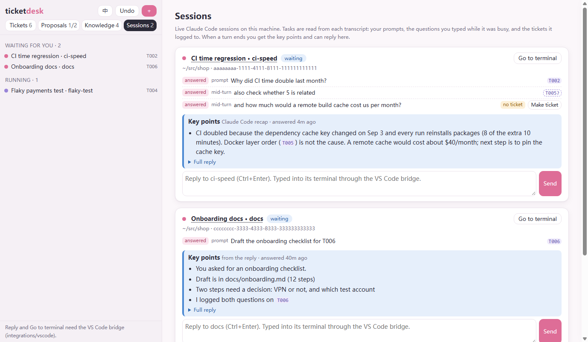

# ticketdesk

A tiny local ticket desk for long-running work shared between **you and your AI agents**.

Chat sessions end, get compacted or get handed to another agent, and what they learned goes with them.
ticketdesk keeps it in one place that every session reads and writes:

- **Tickets** (`T012`): nested question/answer cards. Each has an append-only **work log**: timestamp,
  session id and session name on every entry, so any agent can pick up where another left off.
- **Proposals** (`P003`): actions that need a human's approval. The agent files them and the human clicks
  *Approve* or *Reject*. Optionally, approving runs a vetted script and shows its exit code and output.
- **Knowledge** (`K007`): reusable facts that tickets cite by id. Facts are **retracted with a reason and
  a replacement** instead of being silently edited, and `desk.py check` lists every ticket still citing a
  retracted fact.

It is one Python file for the server, one for the CLI and one HTML page. Standard library only, no
build step, no database.



## Quick start

```sh
git clone https://github.com/<you>/ticketdesk && cd ticketdesk
python server.py                 # http://127.0.0.1:8750/  (data in ~/.ticketdesk)
```

Or let the CLI start it on first use:

```sh
python desk.py add --title "Why did CI time double last month?" --priority P0
python desk.py log T001 "Median of the last 50 runs is 21 min; tests 9, deps 8" --session my-session
python desk.py show T001
```

Try it with sample data:

```sh
python server.py --data ./demo-data --port 8751 &
DESK_URL=http://127.0.0.1:8751 python examples/demo.py
```

Requires Python 3.8+. Works on Windows, macOS and Linux.

## The page

- Left rail: the ticket **tree** (drag a title onto another to re-parent it, drop on the upper edge to
  reorder), or the **proposal** and **knowledge** lists. Filter by status, priority and tag; search covers
  bodies and logs.
- Right pane: one record at a time: question, answer, children, related proposals, cited knowledge, log.
  `#T012` in the URL opens a card directly.
- `T012`, `P003` and `K007` in any text become links with a hover preview. A retracted fact shows up
  struck through.
- Lines starting with `- ` render as bullets; lines starting with `TODO` are highlighted.
- Keys: `/` search · `N` new · `E` edit · `Esc` up one level · `Ctrl+Z` undo (60 steps).
- English and Chinese UI (`中` / `EN` button, or `?lang=zh`); light and dark themes.

## Sessions tab (Claude Code)

If you run Claude Code on the same machine, the **Sessions** tab lists every live session and what it is working on:

- every prompt of the current turn, **including the questions you typed while it was busy** (they are read from the
  session transcript, so they show up even when nobody made a ticket for them);
- the tickets each one touches: `T012` written in a prompt, a bare `12` that matches an existing ticket (shown dashed,
  as a guess), and every ticket the session logged to during the turn;
- a prompt with no ticket gets a **Make ticket** button, which creates the ticket and links it to the session;
- once the turn ends: the **key points** (Claude Code's own recap when there is one, otherwise the headings and list
  items of the reply), the full reply, and a box to **reply right there**. The reply is typed into the session's
  terminal, only when it is idle.

It reads `~/.claude/sessions/*.json` and the transcripts under `~/.claude/projects/` (`CLAUDE_DIR` to change), never
writes them. *Send* and *Go to terminal* need the small VS Code bridge in
[`integrations/vscode`](integrations/vscode/README.md). The same folder has a hook that marks tabs waiting for you
with ▶ without moving or switching tabs.



## The CLI (for agents)

```
desk.py tree [kw] [--status …] [--priority P0|P1|P2|-]   desk.py show T012 [--kids]     desk.py todo
desk.py add / update / log / move                         desk.py handoff T012 T015 --name "…"
desk.py plist / pshow / padd / pupdate / plog / papprove / preject / pdone
desk.py klist / kshow / kadd / kupdate / klog / kretract  desk.py check
```

`python desk.py -h` lists every option. Any text argument written as `@file.md` is read from that file.
Log entries take their session id from `--session`, `$DESK_SESSION` or `$CLAUDE_SESSION_ID`, and their
name from `--name`, `$DESK_SESSION_NAME` or the current directory name.

`desk.py handoff T012 T015` writes a handoff entry on each ticket and prints a brief you can paste into a
fresh session.

## Workflow

The tool matters less than the habits. [`docs/WORKFLOW.md`](docs/WORKFLOW.md) has the rules that made it
useful in practice: ticket first, then act; log failed attempts; record every "next step" the moment it
is said; P0 means keep going without asking; retract facts instead of editing them; hand off through
tickets. A drop-in Claude Code skill is in
[`integrations/claude-code/SKILL.md`](integrations/claude-code/SKILL.md). The same text works as an
`AGENTS.md` section for other agents.

## Configuration

| Flag / env | Default | |
|---|---|---|
| `--data` / `DESK_DATA` | `~/.ticketdesk` | holds `desk.json`, `backups/` (last 200 versions), `runs/` |
| `--port` / `DESK_PORT` | `8750` | |
| `DESK_URL` | `http://127.0.0.1:$DESK_PORT` | used by the CLI; if set, the CLI does not start a server |
| `--allow-run` / `DESK_ALLOW_RUN=1` | off | let *Approve* execute `approve_cmd` |
| `--scripts-dir` / `DESK_SCRIPTS_DIR` | `<data>/scripts` | only scripts inside it (`.py .sh .cmd .bat .ps1`) can run |

## Security

ticketdesk is a single-user local tool.

- It binds `127.0.0.1` only and rejects requests whose `Host` header is not localhost, which blocks DNS
  rebinding.
- Every write must carry `X-Desk-Client: 1`. A web page on another origin cannot add that header without
  a CORS preflight, and the server never approves one, which blocks CSRF from sites you visit.
- Approving a proposal **never executes anything** unless you start the server with `--allow-run`.
  Even then, only a script file inside the scripts directory runs. Paths that escape the directory are
  refused and the proposal is just marked approved.
- Do not expose the port to a network. There is no authentication.

## HTTP API

All JSON. Writes need the header `X-Desk-Client: 1`.

```
GET  /api/state                     everything            GET /api/check   consistency issues
GET  /api/sessions                  live Claude Code sessions, their tasks, ticket refs and key points
POST /api/sessions/<sid>/reply      {text}  type into an idle session's terminal (VS Code bridge)
POST /api/sessions/<sid>/focus      bring its terminal into view
GET  /api/{tickets|proposals|knowledge}/<id>
POST /api/tickets                   create {title, question, answer_title, answer, status, priority, tags, links, source, parent}
POST /api/tickets/<id>              partial update         POST /api/tickets/<id>/log    {text, session, name}
POST /api/tickets/<id>/move         {parent, before}       POST /api/tickets/<id>/delete (children move up)
POST /api/proposals                 create {title, summary, body, tickets, approve_cmd, priority, status: pending|running}
POST /api/proposals/<id>/{log|approve|run|reject|done}
POST /api/knowledge                 create {title, body, tags, links, source}
POST /api/knowledge/<id>/{log|retract}    retract: {reason, superseded_by}
POST /api/undo
```

Invalid input is refused with a 400 and a message: unknown status or priority, empty title, links to
missing tickets, cycles in the tree, more than 200 links. Nothing is silently truncated.

## Tests

```sh
python -m unittest discover -s tests -v
```

The suite starts a real server on a free port with a temporary data directory and drives it over HTTP
and through the CLI. That includes the security guards, each paired with a request that must succeed.

## 中文简介

ticketdesk 是一个本地的 ticket 台，给「人 + 多个 AI agent」做长期项目用：对话会结束、会被压缩、会交接给别的 agent，
ticket 才是跨对话的权威记录。三类记录：**Ticket**（可嵌套的问题/回答卡，带时间戳 + 会话 id + 会话名的日志）、
**提案**（需要人批准的事，页面上点「批准 / 否决」，可选地批准即执行受控脚本）、**知识**（ticket 以 K 编号引用的事实，
作废走「撤回 + 取代」，`desk.py check` 找出仍在引用已撤回事实的 ticket）。界面支持中英文切换（右上角「中 / EN」）。
「对话」页签列出本机活着的 Claude Code 对话：每个对话这一轮的提问、**它运算时你插的问题**（没建 ticket 的也看得到，可一键建 ticket）、
涉及的 ticket；一轮结束后显示要点，可直接在框里回答（经 VS Code 桥打进它的终端）。`integrations/vscode` 里的钩子会给等你回答的
标签名前加 ▶ —— 不挪标签、不切标签、不闪。
工作流规范见 [`docs/WORKFLOW.md`](docs/WORKFLOW.md)：先挂卡再动手、失败的尝试必须记、说出口的下一步当场入卡、
P0 接着做不用问、P2 搁置写理由、交接走 ticket。

## License

MIT
